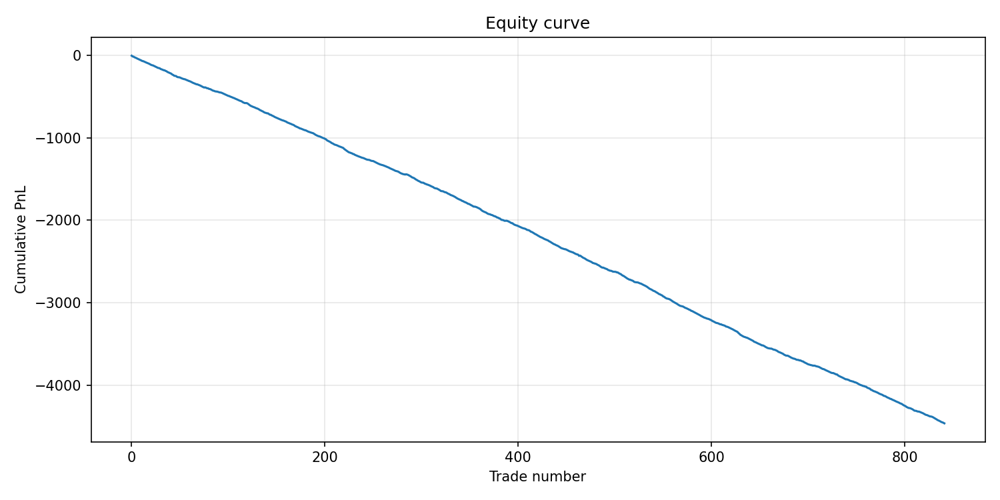
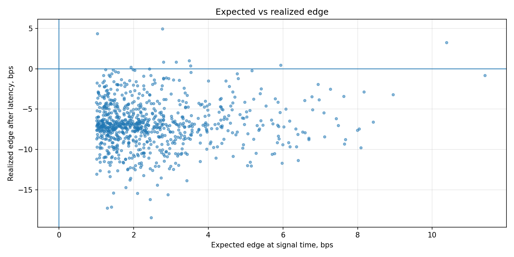
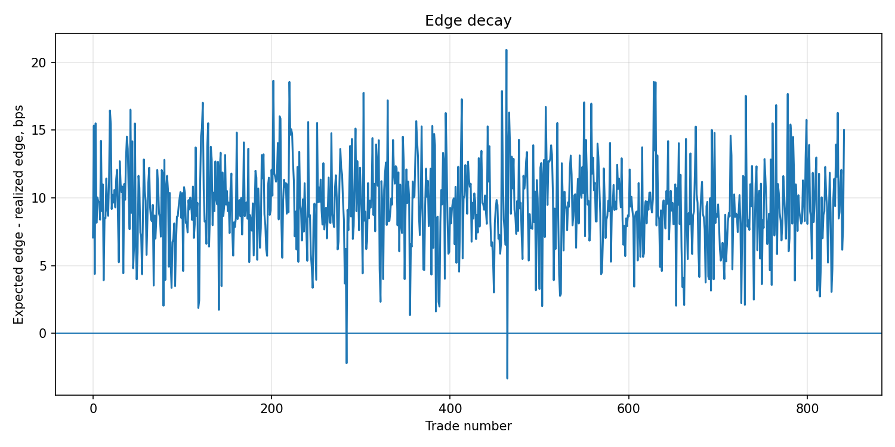

# Cross-Venue Crypto Arbitrage Simulator

Event-driven Python simulator for cross-venue crypto arbitrage.

The project rebuilds the full path from market data to realized PnL:

```text
L2 quote events
→ market-data sequencing
→ consolidated books
→ cross-venue signal
→ latency-aware execution
→ venue inventory accounting
→ replay and diagnostics
```

The main question is simple:

> If an apparent arbitrage exists in the book, how much of it survives after latency, fees, slippage, and depth constraints?

## Features

* Deterministic synthetic L2 market generator
* Multi-venue order-book state
* Receive-time sequencing
* Duplicate and stale update handling
* Depth-aware signal construction
* Taker fee and slippage model
* Latency-aware execution
* Partial fills through visible depth
* Venue-level cash and inventory accounting
* Idempotent signal execution
* Deterministic replay from trade records
* PnL, drawdown, turnover, win-rate, and edge-decay metrics
* Plot pack for equity, drawdown, PnL distribution, and edge decay

## Architecture

```text
MarketEvent stream
        ↓
MarketDataSequencer
        ↓
ConsolidatedBook
        ↓
CrossVenueArbStrategy
        ↓
ExecutionSimulator
        ↓
Portfolio
        ↓
Trade ledger
        ↓
Replay / Metrics / Plots
```

## Core idea

The strategy compares two possible routes:

```text
buy Coinbase → sell Binance
buy Binance  → sell Coinbase
```

A signal is created only if the expected net edge is positive after fees, slippage, and visible L2 depth.

The execution simulator does not fill immediately. It waits for a deterministic latency interval and executes against the later book. This allows the project to measure edge decay:

```text
edge decay = expected signal-time edge - realized post-latency edge
```

This is the central diagnostic of the project.

## Quick start

Create and activate a virtual environment:

```bash
python -m venv .venv
source .venv/bin/activate
```

Windows:

```bash
.venv\Scripts\activate
```

Install the package:

```bash
python -m pip install -e ".[dev]"
```

Run tests:

```bash
pytest -q
```

Run the simulator:

```bash
hft-crypto-arb --config examples/config.yaml --out outputs
```

Alternative without installing the command-line entry point:

```bash
PYTHONPATH=src python -m hft_crypto_arb.cli --config examples/config.yaml --out outputs
```

## Outputs

```text
outputs/trades.csv
outputs/summary.json
outputs/plots/equity_curve.png
outputs/plots/drawdown.png
outputs/plots/pnl_distribution.png
outputs/plots/expected_vs_realized_edge.png
outputs/plots/edge_decay.png
```

## Example summary

The default configuration is intentionally conservative. Many apparent opportunities disappear after latency and transaction costs.

```json
{
  "n_trades": 842,
  "net_pnl": -4463.87,
  "win_rate": 0.0107,
  "avg_expected_edge_bps": 2.53,
  "avg_edge_decay": 7.24,
  "turnover": 12898985.90
}
```

## Diagnostics







## Main modules

```text
src/hft_crypto_arb/market.py      synthetic L2 market generation
src/hft_crypto_arb/feed.py        sequencing and stale-update handling
src/hft_crypto_arb/orderbook.py   order-book state and depth walking
src/hft_crypto_arb/strategy.py    cross-venue signal logic
src/hft_crypto_arb/execution.py   latency-aware two-leg execution
src/hft_crypto_arb/portfolio.py   cash, inventory, and turnover accounting
src/hft_crypto_arb/metrics.py     summary statistics
src/hft_crypto_arb/plots.py       diagnostic plots
src/hft_crypto_arb/replay.py      deterministic replay
src/hft_crypto_arb/backtest.py    end-to-end simulation loop
src/hft_crypto_arb/cli.py         command-line interface
```

## Limitations

This is a research simulator, not a live trading system.

It does not include exchange connectivity, real order-state management, queue position, colocated infrastructure, persistent audit logs, drop-copy reconciliation, monitoring, kill switches, or compliance controls.

## Possible extensions

* Historical L2 data adapter
* Venue-specific latency distributions
* Legging-risk model
* Maker/taker routing logic
* Queue-position model
* Inventory rebalancing between venues
* Scenario sweeps across latency, fees, slippage, and order size